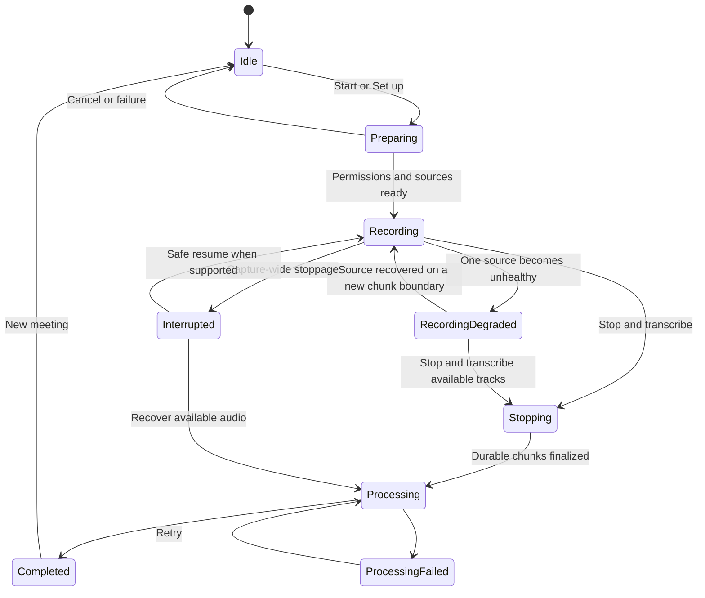
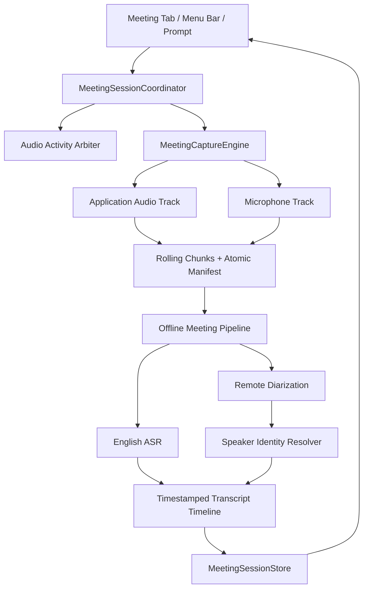

# FluidVoice Meeting Transcription PRD

**Status:** Draft for product alignment  
**Last updated:** 2026-08-05  
**Target:** FluidVoice for macOS 15+  
**Initial release:** English, local recording, offline transcription after Stop  
**Long-term direction:** Optional meeting detection, remembered speaker identities, and live progressive transcription

---

## 1. How to use this document

Every tracked requirement has a checkbox and one of these tags:

- **[MUST · FOUNDATION]** — Must be designed correctly before implementation because later milestones depend on it.
- **[MUST · V1]** — Release blocker for the first trustworthy offline meeting-transcription release.
- **[OPTIONAL · V1]** — Valuable, but may move behind the first release without invalidating the core experience.
- **[MUST · Mx]** — Required for that named milestone; M1 is the first working vertical slice, M2 is the trustworthy V1 gate, and M3–M5 are staged follow-ups.
- **[OPTIONAL · Mx]** — Valuable within that milestone but safe to defer.
- **[CONDITIONAL MUST · Mx]** — Mandatory only if its parent optional capability is enabled.
- **[OPTIONAL · SECURITY]** — Security hardening that must not be claimed until implemented and verified.
- **[FUTURE · LIVE]** — Explicitly outside V1; the V1 architecture must leave a clean path for it.

Checkboxes should be checked only when the requirement and its acceptance criteria are complete. A compiling implementation alone is not completion.

### Document map

- [Confirmed decisions](#3-confirmed-product-decisions)
- [Goals and non-goals](#4-goals-and-non-goals)
- [High-level milestones](#5-high-level-milestones)
- [User experience and canvas states](#7-user-experience-and-canvas-states)
- [Session lifecycle](#8-session-lifecycle)
- [Target architecture](#9-target-architecture)
- [Audio capture](#11-audio-capture-design)
- [Offline transcription](#12-offline-english-transcription-pipeline)
- [Speaker identity](#13-speaker-identity-and-correction)
- [Supported platforms](#14-supported-meeting-platforms)
- [Meeting detection](#15-meeting-detection-and-suggestion-prompt)
- [Menu-bar lifecycle](#16-menu-bar-lifecycle-and-notifications)
- [Privacy and retention](#17-permissions-consent-privacy-and-retention)
- [Acceptance gates](#21-acceptance-and-release-gates)
- [Open decisions](#22-open-decisions-for-alignment)

---

## 2. Product summary

FluidVoice should let someone record an online or in-room meeting locally, stop recording, and receive an English transcript organized by speaker. Online meetings should preserve the user's microphone separately from meeting-app audio so clean speech from a confirmed personal microphone can be labeled **You** while remote participants are diarized. Shared microphones, leakage, and ambiguous overlap must remain explicitly unknown.

The initial release deliberately records first and transcribes after Stop. This protects recording reliability and resource use. The underlying session and transcript models must still support provisional, revisable segments so a future live mode can progressively fill the same transcript canvas without a rewrite.

Speaker diarization answers **who spoke when**, but it does not inherently know real names. FluidVoice may propose a name using visible meeting UI and confirmed local voice profiles, but the user remains the authority through a compact confirmation:

```text
Speaker 2 · Was this Erik?  [Yes] [No]
```

---

## 3. Agreed product requirements — implementation status

The direction below is agreed. Its checkboxes remain open until the corresponding behavior is implemented and verified.

- [ ] **[MUST · V1] DEC-001 — English-only initial release.**
  - Persist `languageCode = "en"` in the session, processing request, history, and exports.
  - Do not scatter hard-coded English assumptions through capture or transcript models.

- [ ] **[MUST · V1] DEC-002 — Local-first data path.**
  - V1 capture and processing never upload meeting audio, transcripts, participant names, or voice embeddings.
  - Network activity is limited to model downloads and exports explicitly initiated by the user.
  - Analytics and diagnostics must exclude their contents.

- [ ] **[MUST · V1] DEC-003 — Explicit recording action.**
  - FluidVoice never begins recording automatically.
  - A meeting-detection prompt may suggest recording, but the user must click **Record**.

- [ ] **[MUST · V1] DEC-004 — Offline-first processing.**
  - V1 records during the meeting and begins ASR/diarization only after Stop.
  - The recording path remains useful even when transcription models are not yet ready.

- [ ] **[MUST · FOUNDATION] DEC-005 — Live-ready schema.**
  - Segments have stable IDs, revisions, and provisional/final state from the start.

- [ ] **[MUST · V1] DEC-006 — Separate online-call tracks.**
  - Meeting/application audio and microphone audio remain separate and timestamped.
  - They are never irreversibly mixed before transcription and identity processing.

- [ ] **[MUST · V1] DEC-007 — Two capture modes.**
  - **Online call:** selected application audio plus selected microphone.
  - **In-room meeting:** selected microphone only; the microphone is not automatically labeled **You**.

- [ ] **[MUST · V1] DEC-008 — Persistent global state.**
  - Recording and processing are app-level activities, not owned by the sidebar tab or main window.

- [ ] **[MUST · V1] DEC-009 — Honest hardware capability.**
  - Apple Silicon receives speaker diarization and identity features.
  - Intel may record and produce a plain transcript, but must not promise remote-speaker separation until supported.

- [ ] **[MUST · V1] DEC-010 — Honest platform claims.**
  - Zoom, Google Meet, and Microsoft Teams are planned optimized targets, not marketed as optimized until their acceptance matrix passes.

---

## 4. Goals and non-goals

### 4.1 Goals

- [ ] **[MUST · V1] GOAL-001 — Trustworthy capture.** Preserve usable meeting audio across long sessions, device changes, window closure, and recoverable failures.
- [ ] **[MUST · V1] GOAL-002 — Useful offline transcript.** Produce a timestamped English transcript with truthful speaker attribution and clear fallbacks.
- [ ] **[MUST · V1] GOAL-003 — Clear local identity.** Label clean speech from a confirmed personal online-call microphone as the configured local user or **You**; preserve uncertainty otherwise.
- [ ] **[MUST · V1] GOAL-004 — Correctable speaker model.** Support global rename, individual reassignment, merge, and undo.
- [ ] **[MUST · M3] GOAL-005 — Reusable identities.** Suggest previously confirmed speakers across meetings without silently assigning names.
- [ ] **[MUST · M4] GOAL-006 — Helpful meeting awareness.** Suggest recording at the right time without stealing focus or creating false confidence.
- [ ] **[FUTURE · LIVE] GOAL-007 — Progressive transcript.** Fill the same canvas during a meeting and reconcile it after Stop.

### 4.2 Non-goals for V1

- [ ] **[MUST · V1] NONGOAL-001 — No automatic recording.**
- [ ] **[MUST · V1] NONGOAL-002 — No live transcription requirement.**
- [ ] **[MUST · V1] NONGOAL-003 — No automatic summaries, action items, calendar integration, or meeting bots.**
- [ ] **[MUST · V1] NONGOAL-004 — No claim of legal compliance or consent determination.** Recording laws and workplace policies vary.
- [ ] **[MUST · V1] NONGOAL-005 — No promise of perfect name identification.** Voice and visual matching produce candidates, not facts.
- [ ] **[MUST · V1] NONGOAL-006 — No tab-specific browser audio claim.** ScreenCaptureKit audio filtering is application-level.
- [ ] **[MUST · V1] NONGOAL-007 — No echo-cancellation claim.** Speaker leakage may be detected or reduced later, but is not solved in V1.
- [ ] **[MUST · V1] NONGOAL-008 — No reuse of dictation capture as the meeting recorder.** Meeting capture has different lifecycle, durability, and ownership requirements.

---

## 5. High-level milestones

### Milestone delivery policy

Each milestone is implemented on a stacked branch targeting `1.6.8/meeting`; only the integration branch targets `main`. A milestone is not complete when code merely compiles.

- [ ] **[MUST · FOUNDATION] DELIVERY-001** Define the milestone's deterministic tests, real-system proof, performance/resource checks, and regression boundaries before implementation is called complete.
- [ ] **[MUST · FOUNDATION] DELIVERY-002** Assign independent architecture/reliability and UX/accessibility reviewers who did not own the implementation.
- [ ] **[MUST · FOUNDATION] DELIVERY-003** Resolve every blocking finding and record deferred non-blockers against a named later milestone.
- [ ] **[MUST · FOUNDATION] DELIVERY-004** Merge the reviewed milestone PR into `1.6.8/meeting`; open one final integration PR from `1.6.8/meeting` to `main` after the intended milestone set is complete.

### Milestone 0 — Decisions and durable foundations

- [ ] **[MUST · FOUNDATION] M0-EXIT-001** Resolve FOUNDATION and V1 open decisions in Section 22; M3/M4 decisions remain gated by their own milestones.
- [ ] **[MUST · FOUNDATION] M0-EXIT-002** Approve the session, track, speaker, identity, and transcript models.
- [ ] **[MUST · FOUNDATION] M0-EXIT-003** Approve the capture/recovery format and app-wide state machine.
- [ ] **[MUST · FOUNDATION] M0-EXIT-004** Approve privacy, retention, platform-support, and Intel fallback copy.

### Milestone 1 — Working vertical slice (not yet a release)

Goal: prove the complete path before polishing secondary automation.

- [ ] **[MUST · M1] M1-EXIT-001** A new Meeting Transcription tab can manually start an online or in-room recording.
- [ ] **[MUST · M1] M1-EXIT-002** Online mode writes separate system/application and microphone tracks.
- [ ] **[MUST · M1] M1-EXIT-003** Stop ends capture, runs offline English transcription, and displays a timestamped result.
- [ ] **[MUST · M1] M1-EXIT-004** Apple Silicon output includes remote speaker labels and, for a confirmed personal microphone with clean speech, a **You** track; uncertain microphone speech remains unknown.
- [ ] **[MUST · M1] M1-EXIT-005** The menu-bar menu shows **Stop Meeting Recording** first while capture is active.
- [ ] **[MUST · M1] M1-EXIT-006** Window closure and sidebar navigation do not stop the session.

#### Milestone 1 test and review gate

- [ ] **[MUST · M1] M1-TEST-001** Deterministic tests cover legal state transitions, concurrent/repeated Start and Stop, stale-generation callbacks, and exactly one finalization/processing job.
- [ ] **[MUST · M1] M1-TEST-002** A real online-call capture proves separate non-empty application/system and microphone files with timestamps inside one session manifest. Dual-track separation, gap, drift, and skew figures are measured in Appendix A; this item still needs the same proof through the app's own writer and manifest, not only the harness.
- [ ] **[MUST · M1] M1-TEST-003** A real in-room capture proves microphone-only recording does not request Screen/System Audio permission solely for that mode.
- [ ] **[MUST · M1] M1-TEST-004** Stop proves the complete offline English path: finalized audio → transcription/diarization → timestamped canvas result.
- [ ] **[MUST · M1] M1-TEST-005** Apple Silicon fixtures cover remote speaker separation, clean confirmed personal-mic **You**, and ambiguous/leaked microphone speech remaining unknown.
- [ ] **[MUST · M1] M1-TEST-006** UI proof covers menu item order and Stop action, menu-bar recording mark, sidebar navigation, main-window close/reopen, and the four canvas states.
- [ ] **[MUST · M1] M1-REVIEW-001** An independent audio/architecture reviewer approves capture ownership, track separation, timestamp handling, provider serialization, and no dictation first-PCM regression.
- [ ] **[MUST · M1] M1-REVIEW-002** An independent UX/accessibility reviewer approves sidebar placement, state clarity, menu-bar behavior, keyboard/VoiceOver labels, and low-resource rendering.
- [ ] **[MUST · M1] M1-REVIEW-003** Every blocking review finding is fixed or explicitly recorded as a later-milestone item before the M1 stacked PR merges.

### Milestone 2 — Trustworthy offline V1

Goal: make the working slice safe to ship.

- [ ] **[MUST · V1] M2-EXIT-001** Recoverable chunking, atomic manifests, source-health monitoring, and relaunch recovery pass.
- [ ] **[MUST · V1] M2-EXIT-002** Transcript correction, history, export, deletion, and retention behavior pass.
- [ ] **[MUST · V1] M2-EXIT-003** Permissions, menu-bar lifecycle, notifications, accessibility, and multi-display behavior pass.
- [ ] **[MUST · V1] M2-EXIT-004** Zoom, Meet, Teams, generic-source, headphone, speaker, device-change, and one-hour capture matrices pass at their claimed tiers.
- [ ] **[MUST · V1] M2-EXIT-005** Apple Silicon and Intel capabilities are accurately gated and described.

### Milestone 3 — Remembered speaker identities

- [ ] **[MUST · M3] M3-EXIT-001** Explicit opt-in voice profiles store only confirmed clean samples.
- [ ] **[MUST · M3] M3-EXIT-002** Future meetings produce conservative name candidates with **Yes/No** confirmation.
- [ ] **[MUST · M3] M3-EXIT-003** Rename, unlink, forget-one-person, and delete-all-profile controls pass.

### Milestone 4 — Platform intelligence and meeting suggestions

- [ ] **[MUST · M4] M4-EXIT-001** Versioned platform adapters power detection and capability reporting.
- [ ] **[MUST · M4] M4-EXIT-002** Opt-in multi-signal meeting detection passes false-positive and cooldown checks.
- [ ] **[MUST · M4] M4-EXIT-003** Notch and top-center prompts remain nonactivating and accessible.
- [ ] **[OPTIONAL · M4] M4-EXIT-004** In-memory active-speaker visuals improve name candidates without affecting recording reliability.

### Milestone 5 — Live progressive transcription

- [ ] **[FUTURE · LIVE] M5-EXIT-001** Bounded live processing emits provisional segments while durable recording remains independent.
- [ ] **[FUTURE · LIVE] M5-EXIT-002** The canvas remains stable during revisions, selection, and scrolling.
- [ ] **[FUTURE · LIVE] M5-EXIT-003** Stop performs final offline reconciliation without losing user corrections.

---

## 6. Information architecture

- [ ] **[MUST · V1] IA-001 — Sidebar placement.** Add **Meeting Transcription** directly below **File Transcription** in the existing **Use** group.
- [ ] **[MUST · V1] IA-002 — Separate product concepts.** File Transcription imports existing media; Meeting Transcription records and owns meeting sessions.
- [ ] **[MUST · FOUNDATION] IA-003 — Shared transcript domain.** Imported files and captured meetings should eventually use the same stable transcript/speaker model even if their orchestration remains separate.
- [ ] **[MUST · V1] IA-004 — One state-driven meeting canvas.** The tab renders setup, recording, processing, result, interrupted, and recovery states from the app-level coordinator.
- [ ] **[MUST · V1] IA-005 — Recent meetings.** Recent sessions appear in the Meeting tab and reopen the same canvas.
- [ ] **[MUST · V1] IA-006 — Stable window behavior.** Changing tabs, minimizing, or closing the main window does not stop recording or processing.
- [ ] **[MUST · V1] IA-007 — Mac command access.** Stop, open meeting, copy, find, export, and settings actions are reachable by keyboard and appropriate menus.

---

## 7. User experience and canvas states

### 7.1 Idle/setup

```text
Meeting Transcription                                   Stored on this Mac

[ Online call ]  [ In-room meeting ]

Meeting audio     Zoom / Google Chrome / Choose application…     Ready
Microphone        MacBook Microphone                              Ready
Language          English
Speaker separation Automatic on Apple Silicon

Headphones recommended for the cleanest speaker separation.

                                             [ Start recording ]

Recent meetings
Design sync · Today · 42 min · 4 speakers
```

- [ ] **[MUST · V1] UX-SETUP-001** Show mode, meeting source, microphone, English, permission status, model readiness, and storage readiness.
- [ ] **[MUST · V1] UX-SETUP-002** Show separate meeting-audio and microphone meters before Start when sources can be sampled safely.
- [ ] **[MUST · V1] UX-SETUP-003** Recommend headphones without blocking speaker use.
- [ ] **[MUST · V1] UX-SETUP-004** Default the editable title to platform plus date/time.
- [ ] **[MUST · V1] UX-SETUP-005** Disable Start with a plain explanation when required permission, source, or disk readiness is missing.
- [ ] **[MUST · V1] UX-SETUP-006** Model unavailability must not prevent recording; it must clearly defer processing until models are available.
- [ ] **[OPTIONAL · V1] UX-SETUP-007** Allow an expected in-room speaker count.
- [ ] **[MUST · V1] UX-SETUP-008** Show an Apple Silicon/Intel capability explanation before recording, not only after processing.

### 7.2 Recording

```text
● Recording · 24:18                     Zoom · MacBook Microphone

Meeting audio  ▂▅▃▆  Healthy
Microphone     ▃▂▅▃  Healthy

The transcript will appear after the meeting.

                                        [ Stop & Transcribe ]
```

- [ ] **[MUST · V1] UX-REC-001** Show elapsed time, meeting source, microphone source, and independent track health.
- [ ] **[MUST · V1] UX-REC-002** Make **Stop & Transcribe** the primary action.
- [ ] **[MUST · V1] UX-REC-003** Stop immediately without confirmation because it preserves the session and begins processing.
- [ ] **[MUST · V1] UX-REC-004** Put **Discard Recording** behind a destructive confirmation and keep it visually secondary.
- [ ] **[MUST · V1] UX-REC-005** Show recording state in the tab, sidebar, and menu bar without relying on color alone.
- [ ] **[MUST · V1] UX-REC-006** Warn immediately when a source disappears and preserve the healthy source.
- [ ] **[OPTIONAL · V1] UX-REC-007** Pause/resume. If deferred, omit it rather than creating a misleading pseudo-pause.

### 7.3 Processing

- [ ] **[MUST · V1] UX-PROC-001** Present explicit stages: **Saving → Identifying speakers → Transcribing → Finalizing**.
- [ ] **[MUST · V1] UX-PROC-002** Remove the recording indicator as soon as capture actually stops; use a visually distinct processing state.
- [ ] **[MUST · V1] UX-PROC-003** Continue processing when the main window closes.
- [ ] **[MUST · V1] UX-PROC-004** Resume safely at a persisted phase/chunk boundary after relaunch.
- [ ] **[MUST · V1] UX-PROC-005** Preserve audio on failure and offer **Retry**, **Reveal Recording**, and **Export Audio**.
- [ ] **[MUST · V1] UX-PROC-006** Preserve a partial transcript when useful and label it incomplete.
- [ ] **[OPTIONAL · V1] UX-PROC-007** Populate finalized transcript sections before the entire offline job completes.

### 7.4 Result

```text
Design sync                                             42:16
[ Barath (You) ] [ Speaker 1 · Rename ] [ Speaker 2 · Rename ]

00:04  Barath (You)
       Let's start with the onboarding changes.

00:11  Speaker 1
       I pushed the updated flow yesterday.

[ Copy ] [ Export ] [ Reveal Recording ] [ New Meeting ]
```

- [ ] **[MUST · V1] UX-RESULT-001** Show timestamped, speaker-grouped, selectable transcript text.
- [ ] **[MUST · V1] UX-RESULT-002** Global speaker rename updates every segment referencing that speaker ID.
- [ ] **[MUST · V1] UX-RESULT-003** Support Copy, Find, text export, JSON export, reveal recording, delete audio, and new meeting.
- [ ] **[MUST · V1] UX-RESULT-004** Deleting audio may preserve the transcript.
- [ ] **[MUST · V1] UX-RESULT-005** Allow individual segment reassignment.
- [ ] **[MUST · V1] UX-RESULT-006** Allow merging mistaken duplicate speakers.
- [ ] **[OPTIONAL · V1] UX-RESULT-007** Split one wrongly combined speaker into two.
- [ ] **[MUST · V1] UX-RESULT-008** Support undo for speaker rename, reassignment, merge, and identity confirmation.
- [ ] **[MUST · V1] UX-RESULT-009** **Export Audio…** offers authoritative separate tracks and an optional mixed convenience file generated on demand; it never silently replaces the originals.
- [ ] **[MUST · V1] UX-RESULT-010** Text/JSON exports omit embeddings, model fingerprints, internal confidence vectors, and private profile metadata.

---

## 8. Session lifecycle



- [ ] **[MUST · FOUNDATION] STATE-001** Implement an app-wide state machine: `idle`, `preparing`, `recording`, `recordingDegraded`, `stopping`, `processing`, `completed`, `interrupted`, `failed`.
- [ ] **[MUST · FOUNDATION] STATE-002** Persist every durable state transition atomically.
- [ ] **[MUST · V1] STATE-003** Treat source loss, app exit, permission revocation, disk exhaustion, sleep/wake, and clock discontinuity as typed events rather than one generic error.
- [ ] **[MUST · V1] STATE-004** Keep capture and processing failure domains separate.
- [ ] **[MUST · V1] STATE-005** Never delete the source recording automatically because transcription failed.
- [ ] **[MUST · V1] STATE-006** Define termination behavior: closing the window continues; quitting presents a clear choice and never implies background survival after process exit. **Stop & Quit** persists `processingPending` and says transcription resumes next launch.
- [ ] **[MUST · V1] STATE-007** Allow only one active meeting capture session at a time.
- [ ] **[MUST · V1] STATE-008** If an older meeting is processing when a new recording starts, checkpoint and queue/pause processing so durable capture receives priority; resume processing after recording stops.

---

## 9. Target architecture



### 9.1 Required components

- [ ] **[MUST · FOUNDATION] ARCH-001 — `MeetingSessionCoordinator`.** App-wide `@MainActor` owner exposed through `AppServices`; coordinates UI state without owning real-time audio callbacks.
- [ ] **[MUST · FOUNDATION] ARCH-002 — `MeetingCaptureEngine`.** Actor/queue-backed ScreenCaptureKit capture owner with bounded callback work.
- [ ] **[MUST · FOUNDATION] ARCH-003 — `MeetingSessionStore`.** Disk-backed, versioned meeting/session index; do not extend the file-transcription UserDefaults store.
- [ ] **[MUST · FOUNDATION] ARCH-004 — `MeetingProcessingPipeline`.** Resumable offline orchestration for track preparation, diarization, ASR, timeline merge, and finalization.
- [ ] **[MUST · FOUNDATION] ARCH-005 — `MeetingPlatformRegistry`.** Local registry of platform detection/capture/name capabilities and caveats.
- [ ] **[MUST · M3] ARCH-006 — `SpeakerProfileStore`.** Versioned local person/profile database independent of meeting deletion.
- [ ] **[MUST · M4] ARCH-007 — `MeetingDetectionService`.** Opt-in sustained multi-signal detector.
- [ ] **[MUST · M4] ARCH-008 — `MeetingSuggestionPresenter`.** Separate from the latency-sensitive dictation notch/bottom-overlay state machine.
- [ ] **[MUST · FOUNDATION] ARCH-009 — Audio activity arbiter.** Explicitly owns conflicts among dictation, command/edit capture, dictionary recording, and meeting capture.

### 9.2 Current code integration

- [ ] **[MUST · FOUNDATION] CODE-001** Add the meeting coordinator lazily to `AppServices`; extend termination shutdown to flush capture without relying on graceful exit for recovery.
- [ ] **[MUST · V1] CODE-002** Add a distinct sidebar destination and menu-bar navigation destination for Meeting Transcription.
- [ ] **[MUST · FOUNDATION] CODE-003** Rename the current file-oriented `MeetingTranscriptionView`/service concept to File Transcription before adding the real meeting view, avoiding two meanings for “meeting transcription.”
- [ ] **[MUST · FOUNDATION] CODE-004** Replace rename-unstable segment IDs. The current file segment ID derives from speaker text and timestamp.
- [ ] **[MUST · FOUNDATION] CODE-005** Return rich diarization output instead of discarding FluidAudio cluster embeddings and quality metadata.
- [ ] **[MUST · V1] CODE-006** Keep meeting sessions out of `FileTranscriptionHistoryStore`; it uses UserDefaults, caps entries, and lacks recovery/audio state.
- [ ] **[MUST · V1] CODE-007** Add an appropriate Screen & System Audio usage description and explicit permission-state handling.
- [ ] **[MUST · V1] CODE-008** Extend the existing `MenuBarManager` rather than creating a second status item.
- [ ] **[MUST · V1] CODE-009** Do not call `ASRService.start()` for meeting recording; reuse only safe file/provider APIs during offline processing.
- [ ] **[MUST · V1] CODE-010** Ensure existing view disappearance and ASR shutdown paths cannot stop the meeting coordinator.

---

## 10. Meeting session and data model

### 10.1 Meeting session

- [ ] **[MUST · FOUNDATION] MODEL-001** Define a versioned `MeetingSession` containing:
  - schema version and session UUID;
  - title and `languageCode`;
  - online/in-room capture mode;
  - platform profile and captured application identity;
  - selected microphone identity;
  - started/ended timestamps and monotonic timebase metadata;
  - session state and typed interruption/failure history;
  - audio track manifests;
  - session speakers and transcript segment IDs;
  - retention/deletion state;
  - processing checkpoints.

### 10.2 Audio tracks and chunks

- [ ] **[MUST · FOUNDATION] MODEL-002** Define `MeetingAudioTrack` with stable ID, kind (`applicationAudio` or `microphone`), source/device metadata, format, shared timebase mapping, health, and ordered chunks.
- [ ] **[MUST · FOUNDATION] MODEL-003** Define `MeetingAudioChunk` with stable ID, sequence, file URL, presentation start/end, discontinuity metadata, checksum, and finalization state.
- [ ] **[MUST · V1] MODEL-004** Make every finalized chunk independently recoverable.

### 10.3 Speakers and transcript segments

- [ ] **[MUST · FOUNDATION] MODEL-005** Define stable `SessionSpeakerID` separately from editable display name and source diarization cluster.
- [ ] **[MUST · FOUNDATION] MODEL-006** Define transcript segments with stable UUID, start/end, source track, speaker ID, text, revision, `provisional/final`, overlap state, and completeness state.
- [ ] **[MUST · FOUNDATION] MODEL-007** Preserve simultaneous speech instead of forcing overlapping sources into a false single-speaker order.
- [ ] **[MUST · FOUNDATION] MODEL-008** Keep identity candidates and confirmations separate from the final display name.

### 10.4 Person profiles

- [ ] **[MUST · M3] MODEL-009** Define stable `PersonID`, editable display name, multiple confirmed embeddings/prototypes, source quality, microphone/room context, model fingerprint, created/updated dates, and consent state.
- [ ] **[MUST · M3] MODEL-010** Invalidate or migrate embeddings when the speaker-embedding model/version changes.

---

## 11. Audio capture design

### 11.1 Online call mode

- [ ] **[MUST · V1] CAP-001** Capture selected meeting-application audio through ScreenCaptureKit `.audio` output.
- [ ] **[MUST · V1] CAP-002** Capture the selected microphone as a separate `.microphone` output on the macOS 15 baseline.
- [ ] **[MUST · V1] CAP-003** Resolve the microphone using the identifier type ScreenCaptureKit expects; do not assume the existing Core Audio UID is directly interchangeable with `AVCaptureDevice.uniqueID`.
- [ ] **[MUST · V1] CAP-004** Use media presentation timestamps as the synchronization source, not callback arrival time or wall-clock `Date`.
- [ ] **[MUST · V1] CAP-005** Exclude FluidVoice audio where supported so cues/notifications are not written into meeting audio.
- [ ] **[MUST · V1] CAP-006** Preserve remote/system and microphone tracks separately through processing and audio export.
- [ ] **[MUST · FOUNDATION] CAP-024** Decide whether V1 source selection uses Apple's `SCContentSharingPicker` or a custom application picker, and document the privacy, control, and maintenance reason for that choice.
- [ ] **[MUST · V1] CAP-025** Consume `.audio` and `.microphone` sample buffers into separate writers; do not use a convenience recording output that mixes away track identity on the macOS 15 baseline.

### 11.2 In-room mode

- [ ] **[MUST · V1] CAP-007** Record the selected microphone through a mic-only Core Audio/AVFoundation backend sharing the durable writer, without requiring Screen/System Audio permission solely for in-room mode.
- [ ] **[MUST · V1] CAP-008** Diarize all detected room speakers, including the local user.
- [ ] **[MUST · V1] CAP-009** Never label the whole in-room microphone as **You**.

### 11.3 Durability and resource behavior

- [ ] **[MUST · V1] CAP-010** Write rolling finalized chunks plus an atomically replaced manifest under Application Support.
- [ ] **[MUST · V1] CAP-011** Bound memory regardless of meeting duration; sample buffers must not accumulate in RAM.
- [ ] **[MUST · V1] CAP-012** Keep capture callbacks minimal and file writes on dedicated serial queues.
- [ ] **[MUST · V1] CAP-013** Use compressed archival tracks or another measured format that avoids multi-gigabyte-per-hour PCM while preserving ASR quality.
- [ ] **[MUST · V1] CAP-014** Normalize/downsample for ASR during offline processing, not on the critical capture callback.
- [ ] **[MUST · V1] CAP-015** Preflight available space and continue monitoring storage while recording.
- [ ] **[MUST · V1] CAP-016** Record explicit chunk boundaries for device changes, sleep/wake, source-app reconnection, and format changes.
- [ ] **[MUST · V1] CAP-017** Losing one source must not silently terminate the healthy source.
- [ ] **[MUST · V1] CAP-018** A crash may lose the unfinalized active chunk, but must preserve all finalized chunks.

### 11.4 Headphones, Bluetooth, and leakage

- [ ] **[MUST · V1] CAP-019** Recommend headphones for online meetings because system audio remains digital and remote speech is less likely to leak into the microphone.
- [ ] **[MUST · V1] CAP-020** Allow AirPods/Bluetooth microphones but warn that using a Bluetooth headset microphone can switch macOS to a lower-quality two-way mode.
- [ ] **[MUST · V1] CAP-021** Recommend built-in/USB microphone plus Bluetooth headphones output when appropriate, without overriding user choice.
- [ ] **[MUST · V1] CAP-022** Detect/report probable duplicate remote speech across the microphone and system tracks; do not claim automatic echo cancellation.
- [ ] **[OPTIONAL · V1] CAP-023** Add timestamp/acoustic duplicate suppression only after evaluation proves it does not remove real overlapping speech.
- [ ] **[MUST · V1] CAP-026** Ask whether the selected online-call microphone is personal or shared. Only a confirmed personal mic may support the default **You** attribution.

### 11.5 Capture API and filter scope

Decided 2026-08-10 from measured evidence on macOS 26.5.1; see Appendix A.

- [ ] **[MUST · FOUNDATION] CAP-027 — ScreenCaptureKit is the V1 capture API.** A one-hour dual-track soak recorded zero gaps, zero backwards timestamps, zero format changes, ~14 ppm clock drift, and a constant 87.6 ms inter-track skew. FB13847291 (`EXC_BAD_ACCESS` on long audio-only capture) did not reproduce. Reliability does not justify migrating to Core Audio process taps.
- [ ] **[MUST · FOUNDATION] CAP-028 — Scope the content filter to a window, never a display.** `SCContentFilter(display:...)` terminates with `SCStreamErrorDomain -3815` on any display power transition, including a one-second blackout, and never recovers. `SCContentFilter(desktopIndependentWindow:)` survives the same event with audio delivery uninterrupted, and still scopes audio to the owning application.
- [ ] **[MUST · V1] CAP-029 — Pin the capture window at Start.** Resolve the selected meeting application's main window once when recording begins and hold it for the session. Never follow keyboard focus; the user will switch apps mid-meeting.
- [ ] **[MUST · V1] CAP-030 — Filter the window candidate list.** `SCShareableContent.windows` includes WindowServer backstops, Dock wallpaper surfaces, menubar strips, and untitled entries. Require an owning application, a non-empty title, a minimum size, and `isOnScreen`. Selecting an unowned system window aborts the process.
- [ ] **[MUST · V1] CAP-031 — Hold a display-sleep power assertion while recording.** Take `kIOPMAssertionTypePreventUserIdleDisplaySleep` for the capture duration and release it on stop and on termination. Do not rely on the implicit assertion Core Audio takes; the system revokes it mid-session.
- [ ] **[MUST · V1] CAP-032 — Treat window loss as a first-class capture risk.** Window scoping trades a display dependency for a window dependency. A browser-hosted meeting binds to the browser window, which the user may close or recreate mid-call. This is why REL-015 is mandatory.

---

## 12. Offline English transcription pipeline

- [ ] **[MUST · V1] PIPE-001** Process the dual-track session manifest rather than pretending a captured meeting is one imported file.
- [ ] **[MUST · V1] PIPE-002** Remote/application track: diarize, preserve cluster IDs/embeddings/quality, and transcribe bounded turns.
- [ ] **[MUST · V1] PIPE-003** Microphone track: detect speech turns and correlate them against remote/system speech. Label clean personal-mic speech as **You**; mark probable leakage, shared-mic speech, or ambiguous overlap as **Microphone / Unknown** rather than misattributing it.
- [ ] **[MUST · V1] PIPE-004** Merge tracks chronologically from their shared timestamp mapping while preserving overlaps.
- [ ] **[MUST · V1] PIPE-005** Preserve raw meeting speech; do not automatically apply dictation filler removal, spoken-punctuation rewriting, or AI enhancement.
- [ ] **[MUST · V1] PIPE-006** Reuse the selected safe file-transcription provider/model path to avoid duplicate model memory, with explicit serialization against dictation.
- [ ] **[MUST · V1] PIPE-007** Checkpoint processing at track/chunk/phase boundaries so relaunch can resume.
- [ ] **[MUST · V1] PIPE-008** Batch turns carefully; avoid one expensive ASR startup per tiny diarization segment.
- [ ] **[MUST · V1] PIPE-009** Treat no-speech, incomplete-track, diarization failure, and ASR failure as distinct outcomes.
- [ ] **[MUST · V1] PIPE-010** Fall back to a complete unlabeled transcript when speaker attribution cannot be completed safely.
- [ ] **[MUST · V1] PIPE-011** On Intel, produce plain remote transcript plus track-origin distinction where possible; do not invent remote speaker labels.
- [ ] **[MUST · FOUNDATION] PIPE-012** Every ASR request reads `languageCode` from its session; adding a future transcription-language picker requires no session-schema migration. Product UI localization remains separate.
- [ ] **[MUST · V1] PIPE-013** Stitch remote speaker clusters across writer rotation, sleep/reconnect, device/format boundaries, and processing chunks using session-wide embeddings so the same person retains one speaker ID.
- [ ] **[MUST · V1] PIPE-014** Pin ASR provider/model/version, diarization model fingerprint, normalization settings, and pipeline version to each processing attempt/checkpoint.
- [ ] **[MUST · V1] PIPE-015** Dictation may preempt/pause meeting processing at a safe checkpoint; prove no concurrent provider mutation, model unload, or partial-result corruption.

---

## 13. Speaker identity and correction

### 13.1 V1 session identity

- [ ] **[MUST · V1] ID-001** Clean speech from a confirmed personal online-call microphone is labeled the configured local name plus **(You)**, or simply **You**; shared/ambiguous/leaked speech is not.
- [ ] **[MUST · V1] ID-002** Remote speakers begin as stable generic labels ordered by first appearance.
- [ ] **[MUST · V1] ID-003** Renaming a speaker changes display metadata, not segment IDs or cluster identity.
- [ ] **[MUST · V1] ID-004** Global rename, segment reassignment, speaker merge, and undo remain available without voice profiles.

### 13.2 Compact candidate confirmation

- [ ] **[MUST · M3] ID-005** Show one unresolved confirmation per unique session speaker, not beside every passage.
- [ ] **[MUST · M3] ID-006** **Yes** renames all linked segments and records an explicit confirmation event.
- [ ] **[MUST · M3] ID-007** **No** rejects only that candidate for that session and does not permanently poison either profile.
- [ ] **[MUST · M3] ID-008** No answer leaves the generic speaker label intact.
- [ ] **[MUST · M3] ID-009** Use wording such as “Was this Erik?” rather than uncalibrated percentages.

### 13.3 Cross-meeting voice profiles

- [ ] **[MUST · M3] ID-010** Persistent profiles are explicit opt-in before the first embedding is stored.
- [ ] **[MUST · M3] ID-011** Learn only from user-confirmed, sufficiently long, clean, non-overlapping speech.
- [ ] **[MUST · M3] ID-012** Store several representative samples/prototypes per person across microphones and rooms.
- [ ] **[MUST · M3] ID-013** Suggest a match only when it clears an evaluated absolute threshold and a margin over the second-best person.
- [ ] **[MUST · M3] ID-014** Preserve an unknown-person outcome; never force the nearest profile.
- [ ] **[MUST · M3] ID-015** Require confirmation again in each meeting until reliability evidence supports a different policy.
- [ ] **[MUST · M3] ID-016** Support same-name people through distinct stable person IDs.
- [ ] **[MUST · M3] ID-017** Provide rename, unlink, forget-one-person, and delete-all-profile controls.
- [ ] **[OPTIONAL · M3] ID-018** Remember aliases by recurring meeting series after a separate product decision.

### 13.4 Visual active-speaker assistance

- [ ] **[OPTIONAL · M4] ID-019** Use platform UI as a candidate-name signal, never as the basis of diarization.
- [ ] **[CONDITIONAL MUST · M4] ID-020** Prefer accessibility-exposed participant labels before OCR where reliable.
- [ ] **[CONDITIONAL MUST · M4] ID-021** Sample low-frequency frames only around remote speech activity and crop to likely participant regions.
- [ ] **[CONDITIONAL MUST · M4] ID-022** Keep frames in memory only; persist only candidate name, time interval, confidence, and platform-rule version.
- [ ] **[CONDITIONAL MUST · M4] ID-023** Require agreement across multiple frames and align the visual interval with the diarized cluster.
- [ ] **[CONDITIONAL MUST · M4] ID-024** Suppress suggestions during overlap, screen sharing, minimized/hidden UI, ambiguous highlights, or voice/visual disagreement.
- [ ] **[CONDITIONAL MUST · M4] ID-025** Fall back silently to voice/manual identity when visual extraction is unavailable.
- [ ] **[CONDITIONAL MUST · M4] ID-026** Obtain separate opt-in before examining the selected meeting window; restrict analysis to that window and likely participant/name regions, and skip shared-screen content.

---

## 14. Supported meeting platforms

### 14.1 Capability model

- [ ] **[MUST · V1] PLATFORM-001** Track support separately for **Recording**, **Meeting Detection**, **Visual Name Suggestions**, and **Voice Recognition**.
- [ ] **[MUST · V1] PLATFORM-002** Define tiers:
  - **Optimized:** claimed capabilities validated against the release matrix.
  - **Compatible:** reliable manual recording/transcription with limited automation.
  - **Beta:** expected to work but not sufficiently validated.
  - **Unsupported:** known capture failure.
- [ ] **[MUST · V1] PLATFORM-003** A platform UI change may downgrade name suggestions without disabling recording.
- [ ] **[MUST · V1] PLATFORM-004** Expose exact tested native app/browser variants rather than one broad platform claim.

### 14.2 Planned initial matrix

| Target | Initial planned claim | Capture | Detection | Name suggestions | Required caveat |
|---|---|---:|---:|---:|---|
| Zoom Workplace desktop | Planned target | Planned—validation required | Planned | Planned | Validate helper/subprocess capture and UI variants |
| Google Meet in Chrome | Planned target | Planned—validation required | Planned | Planned | Same-browser audio may be included |
| Microsoft Teams desktop | Planned target | Planned—validation required | Planned | Planned | Validate current Teams helper/subprocess behavior |
| Google Meet in Safari/Edge/Firefox | Planned compatible target | Planned—validation required | Best effort | Planned voice/manual | Treat each browser as its own variant |
| Webex desktop | Planned compatible target | Planned—validation required | Best effort | Planned voice/manual | UI adapter must pass separately |
| Slack desktop Huddles | Planned compatible target | Planned—validation required | Best effort | Planned voice/manual | Browser Huddles are separate variants |
| FaceTime | Planned beta target | Planned—validation required | Best effort | Planned voice/manual | Validate capture/protected-content behavior first |
| Other app/browser | Manual fallback target | Unknown until selected and checked | No promise | Planned voice/manual | Never imply compatibility before source health is proven |

- [ ] **[MUST · V1] PLATFORM-005** Provide **Choose application…** for unrecognized meeting software.
- [ ] **[MUST · V1] PLATFORM-006** Warn that ScreenCaptureKit exposes no browser-tab audio selector, so unrelated audio from the same browser may be included; do not claim identical behavior across all browsers without validation.
- [ ] **[MUST · V1] PLATFORM-007** Validate Zoom/Teams helper processes; bundle-name matching alone must not earn an optimized claim.
- [ ] **[MUST · V1] PLATFORM-008** Keep platform capture configuration separate from ASR/diarization configuration unless measurements prove an app-specific transcription benefit.
- [ ] **[MUST · M4] PLATFORM-009** Version platform profiles by native/browser variant and known UI generation.
- [ ] **[OPTIONAL · M4] PLATFORM-010** Store last-validated version/date in diagnostics without reporting meeting contents.
- [ ] **[MUST · V1] PLATFORM-011** Show **Works best with** only for validated recording targets, followed by detailed per-capability status. Never present a planned capability as currently supported.

---

## 15. Meeting detection and suggestion prompt

- [ ] **[OPTIONAL · V1] DETECT-001** Ship detection only after manual capture is trustworthy; default milestone is M4.
- [ ] **[MUST · M4] DETECT-002** Make detection opt-in globally and suppressible per application.
- [ ] **[MUST · M4] DETECT-003** Require sustained multi-signal evidence, never a window title alone.
  - Candidate signals: known app/window, process audio input/output activity, active duration, and platform-specific context.
- [ ] **[MUST · M4] DETECT-004** Debounce startup and show at most one prompt per meeting lifecycle.
- [ ] **[MUST · M4] DETECT-005** **Not now** suppresses until that meeting ends.
- [ ] **[MUST · M4] DETECT-006** Offer **Don't suggest for this app**.
- [ ] **[MUST · M4] DETECT-007** Use **Set up** instead of **Record** when permission or source configuration is incomplete.
- [ ] **[MUST · M4] DETECT-008** Merely presenting the suggestion never activates FluidVoice or steals keyboard focus. An explicit **Set up** action may activate the Meeting tab.
- [ ] **[MUST · M4] DETECT-009** Notch Macs use a compact notch expansion.
- [ ] **[MUST · M4] DETECT-010** Non-notch Macs use a top-center HUD on the meeting window's display, not literal screen center or pointer location.
- [ ] **[MUST · M4] DETECT-011** Prompt timeout pauses for hover, keyboard focus, and VoiceOver interaction.
- [ ] **[MUST · M4] DETECT-012** Meeting prompts yield to active dictation/command overlays and never delay dictation's first PCM.
- [ ] **[OPTIONAL · M4] DETECT-013** Leave a subtle Meeting sidebar badge after timeout.
- [ ] **[MUST · M4] DETECT-014** Use concise platform-aware copy:
  - Normal: **“Looks like you're in a Zoom meeting. Record locally?”** with **Record** and **Not now**.
  - First use: the same context with **Set up** and **Not now**.
  - Include the detected app icon without implying FluidVoice has already begun capture.
- [ ] **[MUST · M4] DETECT-015** Provide a keyboard-complete alternative through the FluidVoice menu-bar menu or Meeting tab. The nonactivating HUD may expose pointer and VoiceOver actions without pretending it accepts normal keyboard focus.
- [ ] **[MUST · M4] DETECT-016 — Primary signal is bidirectional per-process audio, and it costs no permission.** Poll `kAudioHardwarePropertyProcessObjectList` for `kAudioProcessPropertyIsRunningInput` and `IsRunningOutput`. A known meeting application holding both concurrently for 10–15 s is a call. Input alone is dictation; output alone is media. Verified permission-free on macOS 26.5.1. Poll rather than listen: the change listeners for these properties are reported not to fire.
- [ ] **[MUST · M4] DETECT-017 — Exclude `com.apple.replayd` and FluidVoice's own bundles from detection.** ScreenCaptureKit microphone capture is attributed to `replayd`, not to the requesting process, so an unguarded detector fires on FluidVoice's own meeting recording.
- [ ] **[MUST · M4] DETECT-018 — Gate the audio signal on process identity.** FluidVoice ships dictation, so an audio-activity signal without an application allowlist will fire on the user's own voice notes. Bidirectionality already excludes that case; do not loosen it without a replacement guard.
- [ ] **[MUST · M4] DETECT-019 — Do not require a calendar match.** Calendar-only detection structurally misses Slack huddles, unscheduled calls, and meetings that start late. A current event with a parsed conferencing URL raises confidence and supplies a default title, but its absence must never veto detection.
- [ ] **[OPTIONAL · M4] DETECT-020 — Handle the muted-mic case as lower confidence.** Participants who join muted produce no input signal. Fall back to a known meeting application with output audio plus a matching window title, camera in use, or an active calendar event, and label the match as weaker rather than folding it into the primary path.
- [ ] **[MUST · M4] DETECT-021 — Prefer Accessibility over Screen Recording for window titles.** `CGWindowListCopyWindowInfo` omits `kCGWindowName` without the Screen Recording grant. `AXUIElement` returns the same information for a cheaper permission.

---

## 16. Menu-bar lifecycle and notifications

### 16.1 Recording

```text
● Stop Meeting Recording
  Recording Zoom · 24:18
  Open Meeting Transcription
────────────────────────────
  Existing FluidVoice menu…
```

- [ ] **[MUST · V1] MENU-001** Extend the existing FluidVoice status item; do not create a second menu-bar icon.
- [ ] **[MUST · V1] MENU-002** Show the FV icon with a recording mark that does not rely on red alone.
- [ ] **[MUST · V1] MENU-003** Make **Stop Meeting Recording** the first enabled menu item while capture is active.
- [ ] **[MUST · V1] MENU-004** Show platform/source, elapsed time, and **Open Meeting Transcription** next.
- [ ] **[MUST · V1] MENU-005** Compute elapsed time when the menu opens; do not run a permanent one-second UI timer.
- [ ] **[MUST · V1] MENU-006** Stop ends recording immediately and begins processing.

### 16.2 Processing, interruption, and completion

- [ ] **[MUST · V1] MENU-007** Replace the red recording state immediately after audio capture stops.
- [ ] **[MUST · V1] MENU-008** Use a distinct amber/processing mark and first row **Transcribing meeting…**.
- [ ] **[MUST · V1] MENU-009** Interrupted capture changes the first action to **Recording interrupted — Open Meeting**.
- [ ] **[MUST · V1] MENU-010** Completion restores the normal icon and posts **Meeting transcript ready**.
- [ ] **[MUST · V1] MENU-011** Temporarily expose **Open Latest Meeting Transcript** first after completion.
- [ ] **[MUST · V1] MENU-012** Provide meaningful accessibility values for Recording, Processing, Interrupted, and Ready.
- [ ] **[MUST · V1] MENU-013** Warn on Quit while recording with two clear choices: cancel Quit and keep recording, or **Stop & Quit — Transcribe Next Launch**, which persists `processingPending` for relaunch.
- [ ] **[OPTIONAL · V1] MENU-014** Add a global Stop Meeting Recording shortcut after conflict review.

---

## 17. Permissions, consent, privacy, and retention

- [ ] **[MUST · V1] PRIV-001** Track microphone and Screen/System Audio permission independently: unknown, granted, denied, restricted, and action required.
- [ ] **[MUST · V1] PRIV-002** Explain why each permission is needed before presenting the system flow.
- [ ] **[MUST · V1] PRIV-003** Keep a visible FluidVoice recording indicator for the complete capture duration; it supplements rather than replaces macOS privacy indicators.
- [ ] **[MUST · V1] PRIV-004** Offer concise pre-start copy reminding the user to ensure participants know the meeting is being recorded.
- [ ] **[MUST · V1] PRIV-005** Do not claim FluidVoice determines recording legality.
- [ ] **[MUST · V1] PRIV-006** Exclude audio, transcript text, participant names, meeting titles, and embeddings from analytics/logs/uploads.
- [ ] **[MUST · V1] PRIV-007** Define retention before release: delete after transcription, 7 days, 30 days, or never.
- [ ] **[MUST · V1] PRIV-008** Distinguish **Delete Audio**, **Delete Meeting**, **Forget Person**, and **Delete All Meeting Data**.
- [ ] **[MUST · V1] PRIV-009** Keep transcript usable after audio-only deletion.
- [ ] **[MUST · V1] PRIV-010** Store sensitive files with owner-only permissions and accurate local-storage copy.
- [ ] **[MUST · V1] PRIV-011** Do not claim app-managed encryption unless authenticated encryption and Keychain-backed key management are actually implemented.
- [ ] **[OPTIONAL · SECURITY] PRIV-012** Add app-managed at-rest encryption after defining streaming/recovery behavior and migration.
- [ ] **[MUST · M3] PRIV-013** Voice-profile opt-in and deletion are independent of meeting retention.
- [ ] **[MUST · V1] PRIV-014** Warn that exported text, JSON, or audio leaves FluidVoice's storage controls and follows the destination's permissions/sync behavior.
- [ ] **[MUST · V1] PRIV-015** Deletion covers active/partial chunks, finalized tracks, manifests, checkpoints, visual candidates, and recovery remnants in the selected scope; do not promise secure erase on APFS.
- [ ] **[MUST · M3] PRIV-016** Complete a separate biometric/privacy review before remembered third-party voice profiles ship; require explicit opt-in, local-only storage, no sync, and dedicated disclosure.
- [ ] **[MUST · M3] PRIV-017** Protect persisted voice profiles with authenticated encryption using a Keychain-held key, or explicitly re-review and approve the weaker storage risk before M3.

---

## 18. Reliability, recovery, and conflicts

- [ ] **[MUST · V1] REL-001** On launch, scan sessions left in recording/stopping/processing states.
- [ ] **[MUST · V1] REL-002** Salvage finalized chunks, mark unexpected capture termination as interrupted, and never auto-delete evidence.
- [ ] **[MUST · V1] REL-003** Offer **Resume Processing**, **Reveal/Export Audio**, and **Delete** for recoverable sessions.
- [ ] **[MUST · V1] REL-004** Handle force quit, power loss, sleep/wake, selected-app exit/relaunch, permission revocation, and disk exhaustion. **Display power transitions are a separate and far more frequent event than system sleep** and must be handled explicitly: idle display sleep, lid close, screen lock, monitor input switch, display unplug, and resolution change, each occurring mid-capture.
- [ ] **[MUST · V1] REL-005** Handle microphone unplug/reconnect, Bluetooth route changes, and sample-rate changes without corrupting prior chunks.
- [ ] **[MUST · V1] REL-006** Handle waiting room → meeting, breakout room/window, browser refresh, and source subprocess changes without silent loss.
- [ ] **[MUST · V1] REL-007** Surface independent last-sample time, level, discontinuity, and failure for each track.
- [ ] **[MUST · V1] REL-008** Meeting recording receives an explicit audio-activity lease.
- [ ] **[MUST · V1] REL-009** V1 dictation hotkeys during meeting recording show a clear “Stop meeting recording first” message rather than opening a competing microphone session.
- [ ] **[MUST · V1] REL-010** Meeting processing serializes safe access to shared ASR models and never corrupts dictation state.
- [ ] **[MUST · V1] REL-011** No meeting prompt, menu update, or indicator adds latency to normal dictation capture when meeting recording is inactive.
- [ ] **[MUST · V1] REL-012** Start, Stop, menu Stop, Quit, and late ScreenCaptureKit/writer callbacks are idempotent and generation-checked; repeated Stop enters disabled **Stopping…** and creates exactly one finalization/processing job.
- [ ] **[MUST · V1] REL-013** Critical-low-disk behavior safely stops and finalizes capture before exhausting the reserve, then notifies the user without deleting audio.
- [ ] **[MUST · V1] REL-014** Processing settings/provider changes cannot mutate an in-flight attempt; a deliberate retry creates a new pinned attempt while preserving prior checkpoints/results.
- [ ] **[MUST · V1] REL-015 — Capture interruption is recoverable, not terminal.** `SCStreamDelegate.stream(_:didStopWithError:)` currently ends the session. It must instead rebuild the stream and resume on a new chunk boundary, with bounded retries and honest degraded state. A transient loss costs a chunk boundary, never a meeting.
- [ ] **[MUST · V1] REL-016 — Do not trust the stop callback alone.** Run a buffer-silence watchdog per track and restart proactively on stall. The delegate callback is not guaranteed to fire, and is reported to arrive with an invalid error object in some teardown races.
- [ ] **[MUST · V1] REL-017 — Screen Recording consent can lapse mid-recording.** macOS re-confirms the grant on a roughly monthly cadence, so revocation during an active capture will eventually happen. Treat it as a typed interruption that preserves all finalized audio and explains what to do, not as a generic failure.

---

## 19. Performance, accessibility, and macOS behavior

### 19.1 Performance

- [ ] **[MUST · V1] PERF-001** Capture CPU, memory, and disk queues remain bounded for a one-hour session.
- [ ] **[MUST · V1] PERF-002** Offline models remain unloaded during capture unless already needed elsewhere.
- [ ] **[MUST · V1] PERF-003** Visual-name assistance, when enabled, runs at a bounded low rate and never competes with audio writes.
- [ ] **[MUST · V1] PERF-004** Transcript rendering remains responsive with hours of segments; do not render an unbounded monolithic SwiftUI tree.
- [ ] **[OPTIONAL · M4] PERF-005** Reduce or pause visual sampling under thermal or Low Power Mode pressure.

### 19.2 Accessibility and Mac conventions

- [ ] **[MUST · V1] A11Y-001** Every primary action is keyboard reachable.
- [ ] **[MUST · V1] A11Y-002** Speaker identity uses explicit **Yes/No** text buttons, not icon-only controls.
- [ ] **[MUST · V1] A11Y-003** VoiceOver has a logical focus order and concise recording/processing/error announcements.
- [ ] **[MUST · V1] A11Y-004** Recording, processing, and failures never rely on color alone.
- [ ] **[MUST · V1] A11Y-005** Respect Reduce Motion, Increase Contrast, and Reduce Transparency.
- [ ] **[MUST · V1] A11Y-006** Transcript text supports standard selection, copy, find, context menus, and undo behavior.
- [ ] **[MUST · V1] A11Y-007** Prompt/HUD behavior works across full screen, Spaces, and multiple displays without focus theft.
- [ ] **[MUST · V1] A11Y-008** The menu-bar workflow remains complete when the main window is closed.
- [ ] **[MUST · V1] A11Y-009** Reuse existing FluidVoice theme typography, cards, buttons, spacing, and control heights; avoid one-off chrome.

---

## 20. Future live-mode seam

- [ ] **[MUST · FOUNDATION] LIVE-001** Coordinator supports transcript mode `.offlineAfterStop` now and `.live` later.
- [ ] **[MUST · FOUNDATION] LIVE-002** Transcript canvas accepts append, revise, finalize, merge, reassignment, and identity-change events for stable IDs.
- [ ] **[MUST · FOUNDATION] LIVE-003** Capture and processing communicate through bounded streams with backpressure; live failure cannot stop durable recording.
- [ ] **[FUTURE · LIVE] LIVE-004** Feed downsampled chunks to a live ASR pipeline while archival writes remain independent.
- [ ] **[FUTURE · LIVE] LIVE-005** Show provisional text/speaker state without excessive visual noise.
- [ ] **[FUTURE · LIVE] LIVE-006** Auto-scroll only while the user is already at the bottom.
- [ ] **[FUTURE · LIVE] LIVE-007** Revisions preserve reading position, selection, and manual corrections.
- [ ] **[FUTURE · LIVE] LIVE-008** Stop runs final offline reconciliation and atomically finalizes provisional segments.
- [ ] **[FUTURE · LIVE] LIVE-009** Apply thermal/memory backpressure and disable live mode clearly on unsupported hardware.

---

## 21. Acceptance and release gates

### 21.1 Platform matrix

- [ ] **[MUST · V1] TEST-PLATFORM-001** For every claimed platform/variant: waiting room, join/rejoin, mute, meeting end, app quit/relaunch, screen share, window resize, minimized/occluded window, breakout room, and app update.
- [ ] **[MUST · V1] TEST-PLATFORM-002** Browser test documents unrelated-tab audio behavior and verifies the warning is accurate.
- [ ] **[MUST · V1] TEST-PLATFORM-003** Zoom/Teams tests prove actual meeting/helper audio reaches the saved system track.
- [ ] **[MUST · V1] TEST-PLATFORM-004** No individual capability receives **Optimized** until that capability's own matrix passes; unavailable detection/name features do not block an independently validated Recording status.

### 21.2 Audio matrix

- [ ] **[MUST · V1] TEST-AUDIO-001** Built-in mic, USB mic, wired headphones, AirPods output, AirPods microphone, device unplug/reconnect, and route change.
- [ ] **[MUST · V1] TEST-AUDIO-002** Headphones and laptop speakers with at least two remote speakers, overlap, silence, and notification/music interference.
- [ ] **[MUST · V1] TEST-AUDIO-003** A long-session test proves both tracks remain within the numeric drift and unexplained-gap budgets set by TEST-BUDGET-001/002.
- [ ] **[MUST · V1] TEST-AUDIO-004** Source meter/health UI agrees with the audio actually written to disk.

### 21.3 Failure and recovery matrix

- [ ] **[MUST · V1] TEST-FAIL-001** Force quit, crash-equivalent termination, sleep/wake, source app quit/relaunch, microphone removal, capture permission revocation, and disk exhaustion.
- [ ] **[MUST · V1] TEST-FAIL-002** Every finalized chunk before failure is recoverable.
- [ ] **[MUST · V1] TEST-FAIL-003** Processing failure preserves audio and retry resumes from a durable checkpoint.
- [ ] **[MUST · V1] TEST-FAIL-004** Window close, tab navigation, and menu-bar-only use do not stop recording.
- [ ] **[MUST · V1] TEST-FAIL-005** Permission lifecycle covers first grant, denial, return from System Settings, revocation, regrant, and relaunch for microphone and Screen/System Audio independently.
- [ ] **[MUST · V1] TEST-FAIL-006** Duplicate Start/Stop/menu/Quit actions and stale callbacks produce exactly one session, one finalized manifest, and one queued processing job.
- [ ] **[MUST · V1] TEST-FAIL-007 — Display power transitions during capture.** Capture must survive a forced `pmset displaysleepnow`, an idle display sleep, a screen lock, and a monitor input switch. Each is verified by continued buffer delivery on both tracks, not merely by the absence of an error.
- [ ] **[MUST · V1] TEST-FAIL-008 — Capture-window loss during capture.** Close and recreate the captured application's window mid-session. Recording either continues or resumes on a new chunk boundary; all finalized chunks survive.
- [ ] **[MUST · V1] TEST-FAIL-009 — One-hour stability run.** A full-hour dual-track capture reports zero gaps, zero backwards timestamps, zero format changes, and drift within the TEST-BUDGET-002 limits.

### 21.4 Speaker and identity matrix

- [ ] **[MUST · V1] TEST-ID-001** Remote speaker labels remain stable through rename, merge, export, persistence, and reopen.
- [ ] **[MUST · M3] TEST-ID-002** Establish a minimum precision target before beta; optimize for fewer trustworthy suggestions rather than broad incorrect coverage.
- [ ] **[MUST · M3] TEST-ID-003** Test unknown people, same-name people, different microphones/rooms, overlapping speech, and visually ambiguous names.
- [ ] **[MUST · M3] TEST-ID-004** **No** does not alter stored profiles; only explicit **Yes** may enroll clean samples.
- [ ] **[MUST · M3] TEST-ID-005** Forget Person removes the profile without corrupting historical transcript display.
- [ ] **[MUST · V1] TEST-ID-006** A remote speaker appearing across multiple processing chunks retains one session-scoped speaker identity unless the evidence is genuinely ambiguous.

### 21.5 Privacy and accessibility matrix

- [ ] **[MUST · V1] TEST-PRIV-001** Inspect storage, analytics, logs, diagnostics, and network traffic for audio/transcript/name leakage.
- [ ] **[MUST · M4 if visual enabled] TEST-PRIV-002** Confirm no meeting screenshots/video frames persist.
- [ ] **[MUST · V1] TEST-A11Y-001** Complete the core workflow with keyboard only and VoiceOver.
- [ ] **[MUST · V1] TEST-A11Y-002** Verify high contrast, reduced motion, reduced transparency, multiple displays, Spaces, and fullscreen meetings.

### 21.6 Repository and release proof

- [ ] **[MUST · V1] TEST-REPO-001** Run SwiftFormat and strict SwiftLint before commit-ready feature work.
- [ ] **[MUST · V1] TEST-REPO-002** Validate implementation builds with `sh build_with_FI_incremental.sh` and inspect the installed `/Applications/FluidVoice.app`.
- [ ] **[MUST · V1] TEST-REPO-003** Do not treat Debug/XCTest-host runs as release proof; use focused logic checks plus installed-app, real-meeting evidence.
- [ ] **[MUST · V1] TEST-REPO-004** Verify the minimum supported macOS path and low-resource Apple Silicon behavior; describe Intel as reduced capability until separately proven.
- [ ] **[MUST · V1] TEST-REPO-006** Run real Intel capture plus plain English transcription before claiming Intel meeting support; universal build slices alone are insufficient.
- [ ] **[MUST · V1] TEST-REPO-005** Update the requested release-notes version locally, credit contributors as required, and never commit ignored release notes.

### 21.7 Measurable budgets to set before implementation

- [ ] **[MUST · FOUNDATION] TEST-BUDGET-001** Set maximum supported meeting duration and the long-session validation duration; one hour alone is not the product limit unless explicitly chosen.
- [ ] **[MUST · FOUNDATION] TEST-BUDGET-002** Set numeric limits for accumulated track drift, unexplained audio gap, source-loss alert latency, and maximum recoverable loss from the active chunk.
- [ ] **[MUST · FOUNDATION] TEST-BUDGET-003** Set disk reserve and warning/safe-stop thresholds.
- [ ] **[MUST · FOUNDATION] TEST-BUDGET-004** Set CPU, RAM, buffer depth, and disk-write budgets for recording on the lowest supported Apple Silicon class.
- [ ] **[MUST · FOUNDATION] TEST-BUDGET-005** Set diarization quality and cross-chunk speaker-continuity targets before calling speaker separation trustworthy.
- [ ] **[MUST · M3] TEST-BUDGET-006** Set identity-candidate precision, unknown rejection, and false-enrollment targets before M3 beta.
- [ ] **[CONDITIONAL MUST · M4] TEST-BUDGET-007** Set visual sampling rate, CPU budget, candidate agreement window, and false-name target before visual assistance ships.

---

## 22. Open decisions for alignment

These do not block writing the PRD. They must be resolved before their associated milestone begins.

- [ ] **[MUST · FOUNDATION] OPEN-001 — Default audio retention.**
  - Recommendation: 7 days, with Delete after transcription, 30 days, and Never.

- [ ] **[MUST · FOUNDATION] OPEN-002 — Dictation during recording.**
  - Recommendation for V1: keep meeting recording healthy and explain that dictation is unavailable until the meeting stops.

- [ ] **[MUST · M3] OPEN-003 — Voice-profile opt-in scope.**
  - Recommendation: explicit first-use explanation plus a per-person **Remember this voice** choice; never infer consent from rename alone.

- [ ] **[MUST · M4] OPEN-004 — Detection release timing.**
  - Recommendation: after trustworthy manual recording, not in the first vertical slice.

- [ ] **[MUST · M4] OPEN-005 — Visual active-speaker release timing.**
  - Recommendation: experimental after voice/manual identity works; platform UI analysis must never block capture.

- [ ] **[MUST · V1] OPEN-006 — Exact optimized variants.**
  - Recommendation: begin with Zoom desktop, Google Meet in Chrome, and current Teams desktop; add browsers/versions only after matrix proof.

- [ ] **[MUST · V1] OPEN-007 — Intel product copy.**
  - Recommendation: recording plus plain English transcript, with **You** versus **Meeting audio** when track origin permits, but no remote-speaker labels.

- [ ] **[OPTIONAL · V1] OPEN-008 — Pause/resume.**
  - Recommendation: defer unless user research makes it essential.

- [ ] **[MUST · V1] OPEN-009 — Stop cue.**
  - Recommendation: no audible cue routed into meeting/application audio; use visual state and optional haptic-equivalent UI only.

- [ ] **[MUST · V1] OPEN-010 — Quit behavior.**
  - Recommendation: closing the window continues; quitting prompts **Keep Recording** (cancel Quit), **Stop & Quit**, or Cancel.

- [ ] **[MUST · V1] OPEN-011 — Local display name source.**
  - Recommendation: a meeting-specific preferred name stored in FluidVoice, editable from the transcript participant chip.

- [ ] **[MUST · V1] OPEN-012 — Backup policy.**
  - Decide whether recordings, transcripts, and voice profiles participate in FluidVoice backup/export independently.

---

## 23. Highest-risk implementation traps

- [ ] **[MUST · FOUNDATION] RISK-001** ScreenCaptureKit microphone identifiers may not equal the current Core Audio device UID.
- [ ] **[MUST · FOUNDATION] RISK-002** The current diarization wrapper discards the embeddings needed for remembered identity.
- [ ] **[MUST · FOUNDATION] RISK-003** Current speaker-segment IDs change when the speaker name changes.
- [ ] **[MUST · FOUNDATION] RISK-004** Current file-history/UserDefaults storage is unsuitable for long recordings and crash recovery.
- [ ] **[MUST · FOUNDATION] RISK-005** A whole-file local-mic transcript cannot be accurately merged with remote turns without speech timestamps.
- [ ] **[MUST · FOUNDATION] RISK-006** Reusing `ASRService.start()` would entangle meeting capture with dictation streaming, media pausing, and teardown.
- [ ] **[MUST · FOUNDATION] RISK-007** Existing menu-bar `isRecording` means dictation only, and the current template icon does not actually draw the requested red dot.
- [ ] **[MUST · FOUNDATION] RISK-008** Changing a ScreenCaptureKit stream/device configuration mid-session can create interruption; represent it as a chunk boundary.
- [ ] **[MUST · V1] RISK-009** Browser capture is application-wide, and Zoom/Teams helper-process behavior needs real proof.
- [ ] **[MUST · V1] RISK-010** Meeting recovery cannot depend on the existing graceful shutdown timeout.
- [ ] **[MUST · M4] RISK-011** Active-speaker visuals are brittle across layout changes, sharing, overlap, and minimized windows.
- [ ] **[MUST · M3] RISK-012** Incorrect profile enrollment compounds future errors; only confirmed clean speech may update a profile.
- [ ] **[MUST · V1] RISK-013 — A display-scoped ScreenCaptureKit filter dies on any display power transition.** Measured, not theoretical: a one-second display blackout terminates the stream with `-3815` and it never recovers. The user sees the display return and the meeting continue while the transcript has silently stopped. Mitigated by CAP-028 and REL-015.
- [ ] **[MUST · V1] RISK-014 — The two SCK audio outputs are not on one clock.** `.audio` and `.microphone` arrive with different format descriptions (measured 48 kHz stereo versus 48 kHz mono) and independent presentation-timestamp epochs, offset by a per-session constant (measured 87–98 ms). Feeding both into one writer corrupts the container. Use one writer per track and take each track's own first-buffer timestamp as its origin.
- [ ] **[OPTIONAL · SECURITY] RISK-015 — Screen Recording is a heavy consent ask for an audio feature.** The system dialog says FluidVoice can record screen contents, and macOS re-confirms roughly monthly. Core Audio process taps use `NSAudioCaptureUsageDescription` instead, with no periodic re-consent, but require solving per-process audio attribution for multi-process apps such as Chrome, Zoom, and Electron clients. Revisit after the capture layer is stable; not a V1 blocker.

---

## Appendix A — Capture reliability measurements (2026-08-10)

Host: macOS 26.5.1 (25F80), Apple Silicon. Harness mirrored the `1.6.8/meeting-m1` `SCStreamConfiguration` exactly.

| Experiment | Configuration | Result |
|---|---|---|
| 60-minute soak | Display-scoped filter | Terminated at 20:18 with `-3815` when the display slept. Screen lock excluded: lock delay was 300 s and the session stayed unlocked. |
| 60-minute soak | Display-scoped filter, display held awake | Ran the full 3600 s. Zero gaps, zero backwards timestamps, zero format changes, ~14 ppm drift, 30 ms track differential over the hour, constant 87.6 ms skew. FB13847291 did not reproduce. |
| Trigger isolation | Display-scoped filter, forced `displaysleepnow` | Died within one second of display-off and did not recover when the display returned one second later. |
| Filter comparison | Window-scoped filter, forced `displaysleepnow`, three runs | Survived every time. Audio delivery continuous through the blackout. App-track silence 2.8% against an emitting app, 100% against a silent app, confirming audio remains scoped to the owning application. |

Both follow-ups closed 2026-08-10 on the implemented branch:

| Follow-up | Result |
|---|---|
| Screen lock during window-scoped capture | Survived. 92 s run with the session locked mid-capture: zero gaps, continuous app-audio delivery through lock and unlock. |
| Captured window closed, replacement opened 2 s later | No interruption through the app runtime: no `sourceLost`, app audio kept flowing, and a subsequent forced display sleep produced zero events — confirming the stream remained window-scoped. A standalone harness had shown stream death ~17 s after window close, so both outcomes exist in the wild; the death path is covered by REL-015's rebuild (verified live: `sourceLost` → `sourceRecovered` in 1 s). |

---

## 24. Primary references

- Apple ScreenCaptureKit: <https://developer.apple.com/documentation/screencapturekit>
- Apple `SCContentFilter`: <https://developer.apple.com/documentation/screencapturekit/sccontentfilter>
- Apple ScreenCaptureKit application-level audio discussion: <https://developer.apple.com/videos/play/wwdc2022/10155/>
- Apple ScreenCaptureKit introduction: <https://developer.apple.com/videos/play/wwdc2022/10156/>
- Apple Core Audio process input activity: <https://developer.apple.com/documentation/coreaudio/kaudioprocesspropertyisrunninginput>
- Apple Bluetooth headset quality behavior: <https://support.apple.com/en-us/102217>
- Google Meet requirements: <https://support.google.com/meet/answer/7317473>
- Google Meet layouts: <https://support.google.com/meet/answer/9292748>
- Zoom Workplace desktop app: <https://support.zoom.com/hc/en/article?id=zm_kb&sysparm_article=KB0064516>
- Slack Huddles: <https://slack.com/help/articles/4402059015315-Use-huddles-in-Slack>
- Webex system requirements: <https://help.webex.com/en-us/article/nk90t65/Webex-App-System-Requirements-and-Support-Policy>
